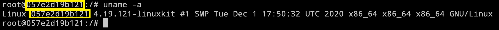

# Devops Instructions

## Docker

### Docker Info
### Docker Image
### Docker Container
### Docker Network
### Docker Volume

Pieces of information about Docker daemon
```
docker system info
```
Resource allocation (Docker resources usage)
```
docker system df
```
Docker images listing
```
docker images
```
Docker containers listing (active containers = running containers)
```
docker ps
```
Docker containers listing (all containers)
```
docker ps -a
```
Docker containers listing
```
docker volume ls
```
Docker volume metadata
```
docker volume inspect VOLUME_NAME
```
Manually remove (delete) Docker volume
```
docker volume rm VOLUME_NAME
```
Automatically remove (delete) Docker volume
```
docker volume prune
```
Creates and runs Docker containers (bash command; **interactive mode**; 
This way, you get an interactive shell and you are immediately logged into the OS running as container;
You are currently in an interactive shell session inside the Docker container)
```
docker run -it --name ubuntu-1 ubuntu:18.04 bash
```
Creates and runs Docker containers (sleep 5 command; **daemon mode**; 
This way the container starts and run in the background; An interactive shell that runs bash is **not available** immediately; 
You “daemonize” the container)
```
docker run -d --name ubuntu-2 ubuntu:18.04 sleep 5
```
Manually remove (delete) Docker containers
```
docker rm CONTAINER_NAME
```
Multiple Docker containers removal
```
docker rm CONTAINER_NAME1 CONTAINER_NAME2
```
Automatically remove (delete) Docker containers
```
docker container prune
```
After the container is shut down, the container will be automatically deleted (ideal for testing purposes)
```
docker run -it --rm --name ubuntu-3 ubuntu:18.04 bash
```
Manually remove (delete) Docker images
```
docker image rm IMAGE_NAME
```
Automatically remove (delete) Docker images
```
docker image prune -a
```
Pull Docker image from Docker Hub Container Image Library
```
docker pull python
```
Accessing Thin R/W Layer after container crashes (snapshot of Docker container file system)
```
docker commit CONTAINER_ID BACKUP_IMAGE_NAME:BACKUP_IMAGE_TAG
```
Run existing Docker container (Run a Docker container in **interactive mode**)
```
docker start -i CONTAINER_NAME or CONTAINER_ID
```
Run existing Docker container (Run a Docker container in **daemon mode**)
```
docker start CONTAINER_NAME or CONTAINER_ID 
```
Stop one or more running containers (Suppose you run a Docker container in **daemon mode**)
```
docker stop CONTAINER_NAME or CONTAINER_ID
```
```
docker kill CONTAINER_NAME or CONTAINER_ID
```
Stop and exit Docker container (Suppose you run a Docker container in **interactive mode**)
```
exit 
```
```
ctrl+d 
```
Exit Docker container without stopping it (Suppose you run a Docker container in **interactive mode**;
detach container; “detach” from the interactive session to leave your conainer running in the background;
Keep your container running in the background; When detached, your container will keep on running even if you exit the container. 
Your interactive Docker session is now in daemon mode; You can detach from an interactive Docker session without stopping a Docker container;
You “daemonize” the container; Keeps the container running but frees up your terminal)
```
ctrl+p and ctrl+q one after another
```
Get inside of a running Docker container (Suppose you run a Docker container in **daemon mode**)
``` 
docker attach CONTAINER_NAME or CONTAINER_ID
```
```
docker exec -ti CONTAINER_NAME or CONTAINER_ID bash
```
Get outside of a running Docker container (Suppose you run a Docker container in **interactive mode**)
``` 
ctrl+p and ctrl+q one after another
```
Check if you are inside of a running Docker container
```
uname -a
```

Create Docker image from Dockerfile (using traditional Docker build)
```
docker image build -t IMAGE_NAME DOCKERFILE_PATH
```
```
docker image build -t first-app .
```
```
docker image build -t first-app ./
```
Containers logs (Suppose you run a docker container in **daemon mode**)
```
docker logs CONTAINER_NAME or CONTAINER_ID
```
