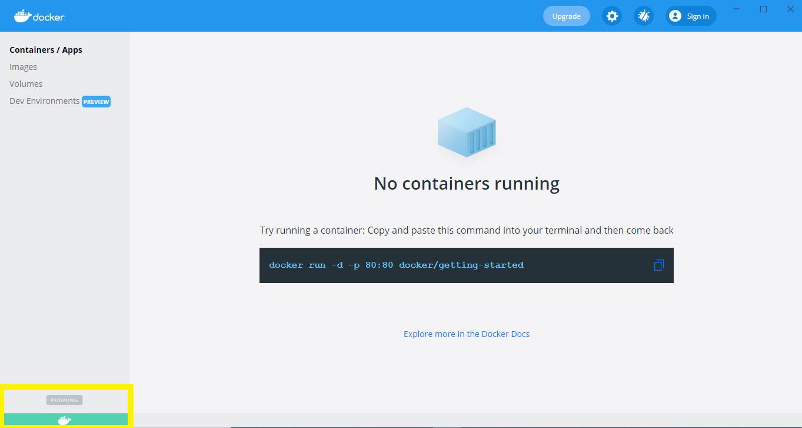
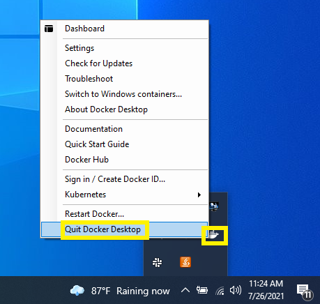
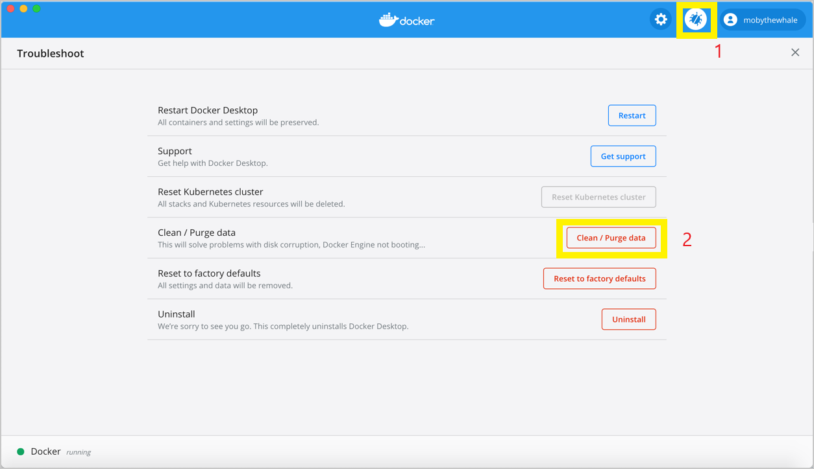
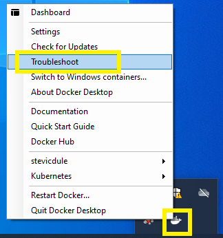
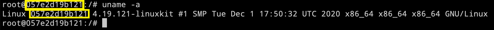
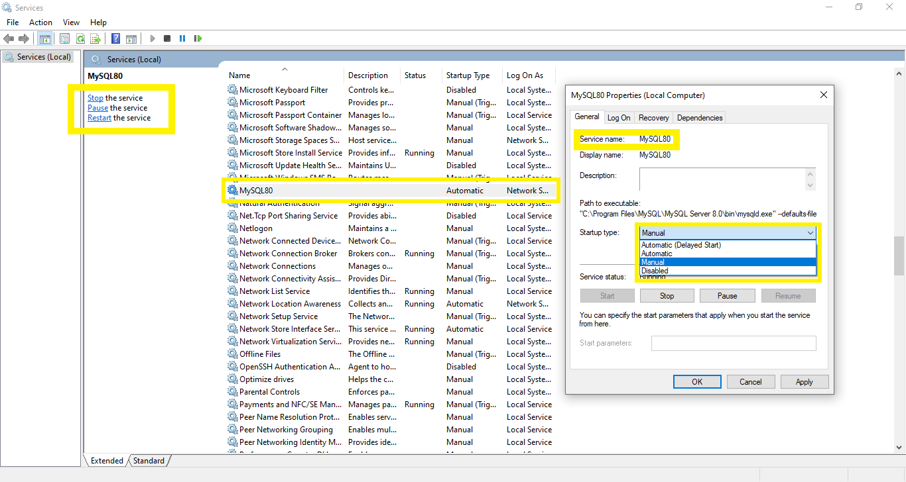

# Containerization Instructions

## Docker Daemon
**Start Docker Daemon:** If you're using Docker for Windows, Then simply start the desktop app installed in:
```
C:\Program Files\Docker\Docker\Docker Desktop.exe
```
**Start Docker Daemon** with Windows PowerShell
```
start "C:\Program Files\Docker\Docker\Docker Desktop.exe"
```

**Stop Docker Daemon:** After you right clicking Docker’s whale icon in task bar. You’ll see ‘Quit Docker Desktop’ item in list:
```
Task bar → Docker’s whale icon → right click → Quit Docker Desktop
```


Pieces of information about Docker daemon
```
docker system info
```
**Docker Desktop clean purge data**

Select this option to delete container and image data. Choose whether you’d like to delete data from Hyper-V, WSL 2, or Windows Containers and then click Delete to confirm

```
Task bar → Docker’s whale icon → right click → Troubleshoot
```

## Docker 
### Docker Info
Docker version
```
docker version
```
```
docker --version
```
Resource allocation (Docker resources usage)
```
docker system df
```
### Docker Image
Docker images listing
```
docker images
```
Create Docker image from Dockerfile with Docker BuildKit (**Using existing .jar binary file**; .jar file is already generated)
```
docker image build -t IMAGE_NAME DOCKERFILE_PATH
```
```
docker image build -t first-app .
```
Create Docker image from Dockerfile with Docker BuildKit (**Generating .jar binary file**; .jar file is not already generated, so we need to map source code to .jar file)
```
docker image build --target DOCKERFILE_STAGE -t DOCKER_HUB_USERNAME/IMAGE_NAME:VERSION DOCKERFILE_PATH
```
```
docker image build --target appServerRuntime -t danijelradakovic/servers:0.1.0 .
```
Pull Docker image from Docker Hub Container Image Library
```
docker pull python
```
```
docker pull danijelradakovic/heroku-terraform:latest
```
Manually remove (delete) Docker images
```
docker image rm IMAGE_NAME
```
Automatically remove (delete) Docker images
```
docker image prune -a
```
How to rename Docker images without rebuilding it
```
docker image tag OLD_NAME:tag NEW_NAME:tag
```
```
docker image tag OLD_ID NEW_NAME:tag
```
```
docker image tag danijelradakovic/heroku-terraform stevicdule/heroku-terraform
```
### Docker Container
Docker containers listing (active containers = running containers)
```
docker ps
```
Docker containers listing (all containers)
```
docker ps -a
```
Creates and runs Docker container (bash command; **interactive mode**; 
This way, you get an interactive shell and you are immediately logged into the OS running as container;
You are currently in an interactive shell session inside the Docker container)
```
docker run -MODE --name CONTAINER_NAME IMAGE_NAME COMMAND
```
```
docker run -it --name ubuntu-1 ubuntu:18.04 bash
```
Creates and runs Docker container (sleep 5 command; **daemon mode**; 
This way the container starts and run in the background; An interactive shell that runs bash is **not available** immediately; 
You “daemonize” the container)
```
docker run -MODE --name CONTAINER_NAME IMAGE_NAME COMMAND
```
```
docker run -d --name ubuntu-2 ubuntu:18.04 sleep 5
```
Manually remove (delete) Docker containers
```
docker rm CONTAINER_NAME
```
Multiple Docker containers removal
```
docker rm CONTAINER_NAME1 CONTAINER_NAME2
```
Automatically remove (delete) Docker containers
```
docker container prune
```
After the container is shut down, the container will be automatically deleted (ideal for testing purposes)
```
docker run -it --rm --name ubuntu-3 ubuntu:18.04 bash
```

Accessing Thin R/W Layer after container crashes (snapshot of Docker container file system)
```
docker commit CONTAINER_ID BACKUP_IMAGE_NAME:BACKUP_IMAGE_TAG
```
Run existing Docker container (Run a Docker container in **interactive mode**)
```
docker start -i CONTAINER_NAME or CONTAINER_ID
```
Run existing Docker container (Run a Docker container in **daemon mode**)
```
docker start CONTAINER_NAME or CONTAINER_ID 
```
Stop one or more running containers (Suppose you run a Docker container in **daemon mode**)
```
docker stop CONTAINER_NAME or CONTAINER_ID
```
```
docker kill CONTAINER_NAME or CONTAINER_ID
```
Stop and exit Docker container (Suppose you run a Docker container in **interactive mode**)
```
exit 
```
```
ctrl+d 
```
Exit Docker container without stopping it (Suppose you run a Docker container in **interactive mode**;
detach container; “detach” from the interactive session to leave your conainer running in the background;
Keep your container running in the background; When detached, your container will keep on running even if you exit the container. 
Your interactive Docker session is now in daemon mode; You can detach from an interactive Docker session without stopping a Docker container;
You “daemonize” the container; Keeps the container running but frees up your terminal)
```
ctrl+p and ctrl+q one after another
```
Get inside of a running Docker container (Suppose you run a Docker container in **daemon mode**)
``` 
docker attach CONTAINER_NAME or CONTAINER_ID
```
```
docker exec -ti CONTAINER_NAME or CONTAINER_ID bash
```
Get outside of a running Docker container (Suppose you run a Docker container in **interactive mode**)
``` 
ctrl+p and ctrl+q one after another
```
Check if you are inside of a running Docker container
```
uname -a
```


Containers logs (Suppose you run a docker container in **daemon mode**)
```
docker logs CONTAINER_NAME or CONTAINER_ID
```
Container port forwarding (Ports exposed from Linux are forwarded to the host; 
Publishes all exposed ports of the container to ports on the host)
```
docker run -MODE --name CONTAINER_NAME -p HOST_PORT:CLIENT_PORT IMAGE_NAME
```
```
docker run -MODE --name CONTAINER_NAME -p HOST_PORT:CONTAINER_PORT IMAGE_NAME
```
```
docker run -MODE --name CONTAINER_NAME -p PUBLISHED_PORT:EXPOSED_PORT IMAGE_NAME
```
```
docker run -it --name servers-0.1.0 -p 9000:8080 danijelradakovic/servers:0.1.0
```
Container Port conflicts with existing databases installed on your machine (If you publish a port that is already in use by another application there will be conflicts. Port 3306 (default port) is already in use by the MySQL database server. Port 5432 (default port ) is already in use by the PostgreSQL database server. There are two solutions: use another port for port publishing and shut down database servers on your machine)

Container port forwarding conflicts first solution (Use another port for port publishing 3306→**3307**)
```
docker run -d --network first-network --name mysql -e MYSQL_ROOT_PASSWORD=password -e MYSQL_USER=sa -e MYSQL_PASSWORD=zgadija -e MYSQL_DATABASE=servers -p 3307:3306 mysql:8.0.19
```
Container port forwarding conflicts second solution (Shut down database servers on your Windows machine using command line. **Run the CLI as Administrator**)
```
net stop SERVICE_NAME
```
```
net start SERVICE_NAME
```
```
net stop MySQL80
```
```
net start MySQL80
```
```
net stop postgresql-x64-13
```
```
net start postgresql-x64-13
```
Container port forwarding conflicts second solution (Shut down database servers on your Windows machine using services.msc; If it is running as a Windows service: Start -> Run -> (then type in:) services.msc. When you see PostgresSQL services set them to manual instead of automatic. If you do need them again, just fire up services.msc again and click the Start icon/button once you have reselected the PostgresSQL service.)
```
Windows Start → Run → services.msc → Search Postgres/MySQL service → Right click the service → properties → manual → stop/start/pause
```

### Docker Network
Docker networks listing
```
docker network ls
```
Docker network metadata
```
docker network inspect NETWORK_NAME or NETWORK_ID
```
Manually remove (delete) Docker network
```
docker network rm NETWORK_NAME or NETWORK_ID
```
Automatically remove (delete) Docker network
```
docker network prune
```
### Docker Volume
Docker volumes listing
```
docker volume ls
```
Docker volume metadata
```
docker volume inspect VOLUME_NAME
```
Manually remove (delete) Docker volume
```
docker volume rm VOLUME_NAME
```
Automatically remove (delete) Docker volume
```
docker volume prune
```

## Docker Compose
### Docker Compose Info
```
docker-compose version
```
```
docker-compose --version
```
### Docker Compose Infrastructure
Mapping environment variables from environment file in the config folder to the docker-compose.yml file (Substitute environment variables in Compose files;
It’s possible to use environment variables to populate values inside a Docker Compose file; If you have multiple environment variables, you can substitute them
by adding them to a default environment variable file named .env or by providing a path to your environment variables file using the --env-file command line option;
Check how your docker-compose.yml will finally look like, after environment variables substitution)
```
docker-compose --env-file ENVIRONMENT_FILE_PATH config
```
```
docker-compose --env-file config/.env.dev config
```
Docker-compose services/containers listing (one service one container)
```
docker-compose ps
```
Logs of all services in the docker-compose file
```
docker-compose logs
```
Logs of particular service in the docker-compose file
```
docker-compose logs SERVICE_NAME (SERVICE_NAME from docker-compose.yml file)
```
```
docker-compose logs database
```
To set up infrastructure run the following command:
```
docker-compose up --build
```
To destroy infrastructure run the following command:
```
docker-compose down -v
```
## Docker Hub
Log in to Docker Hub
```
docker login
```
Log out to Docker Hub
```
docker logout
```
Push your Docker image to Docker Hub
```
docker push DOCKERHUB_USERNAME/DOCKERHUB_REPO_NAME
```
```
docker push stevicdule/heroku-terraform
```
