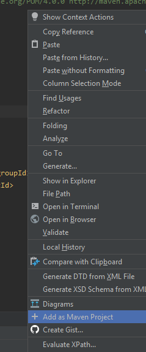
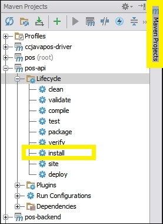
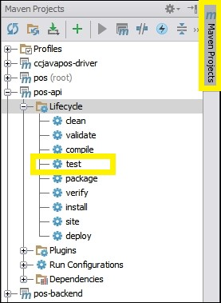

# General Instructions

## GitHub
### Add Your SSH Key to your SSH Agent
Enable the SSH agent:
```
eval "$(ssh-agent -s)"
```
Add Your SSH Key to your SSH Agent
```
ssh-add ~/.ssh/id_rsa
```
## Angular
### How to run Angular code from Github
```
npm install
```
```
ng serve --open
```
## Windows
### How to display the contents of an environment variable from the Command Line Interface (CLI) in Windows
```
echo %OS%
```
```
echo %NUMBER_OF_PROCESSORS%
```
### Check resources (CPU, Memory, Disk, Network) usage
```
Ctrl+Shift+Esc is a keyboard shortcut that opens the Microsoft Windows Task Manager
```
```
Right-Click the Taskbar → choose Task Manager
```


Check resources (**CPU**, **Memory**, **Disk**, **Network**) usage


## IntelliJ IDEA
### Activate Maven tool window
```
Right-Click on the pom.xml file  →  Add as Maven Project
```

### Create an executable JAR in Maven
```
In the Maven tool window, in the Lifecycle list, double-click the install command to generate the jar file.
```

### Testing in Maven
```
In the Maven tool window, in the Lifecycle list, double-click the test command to generate the jar file.
```

